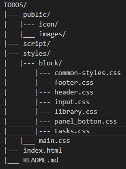

# TODOS - Сайт для управления задачами

## Возможности
- Добавление новых задач
- Отметка выполненных задач
- Удаление задач
- Редактирование задач двойным кликом
- Фильтрация задач: Все, Активные, Завершенные
- Массовое выделение/снятие выделения всех задач
- Очистка завершенных задач
- Подсчет оставшихся задач
- Адаптивный дизайн

## Системные требования
- Веб-браузер: Edge, Chrome и др.
- Интернет-соединение должно быть стабильным и быстрым (для загрузки иконок)
- Разрешение экрана от 320px и выше

## Установка и настройка
1. Скачайте файлы проекта из репозитория
2. Распакуйте файлы
3. Откройте `index.html` в браузере

## Управление сайтом
### Основные разделы
- `Поле ввода` - добавление новых задач (Enter для сохранения)
- `Стрелка` - выделение/снятие выделения всех задач
- `Чекбоксы` - отметка выполнения задач
- `Кнопки фильтров` - переключение между всеми/активными/завершенными задачами
- `Счетчик` - отображение количества оставшихся задач
- `Кнопка очистки` - удаление всех завершенных задач

### Основные функции
- `Добавление задачи:` Введите текст в поле ввода и нажмите Enter
- `Отметка выполнения:` Нажмите на чекбокс слева от задачи
- `Удаление задачи:` Нажмите на кнопку удаления (крестик) справа от задачи
- `Редактирование задачи:` Двойной клик по тексту задачи
- `Массовое управление:` Клик по стрелке для выделения всех/снятия выделения
- `Фильтрация:` Используйте кнопки All/Active/Completed для фильтрации задач

## Структура проекта
